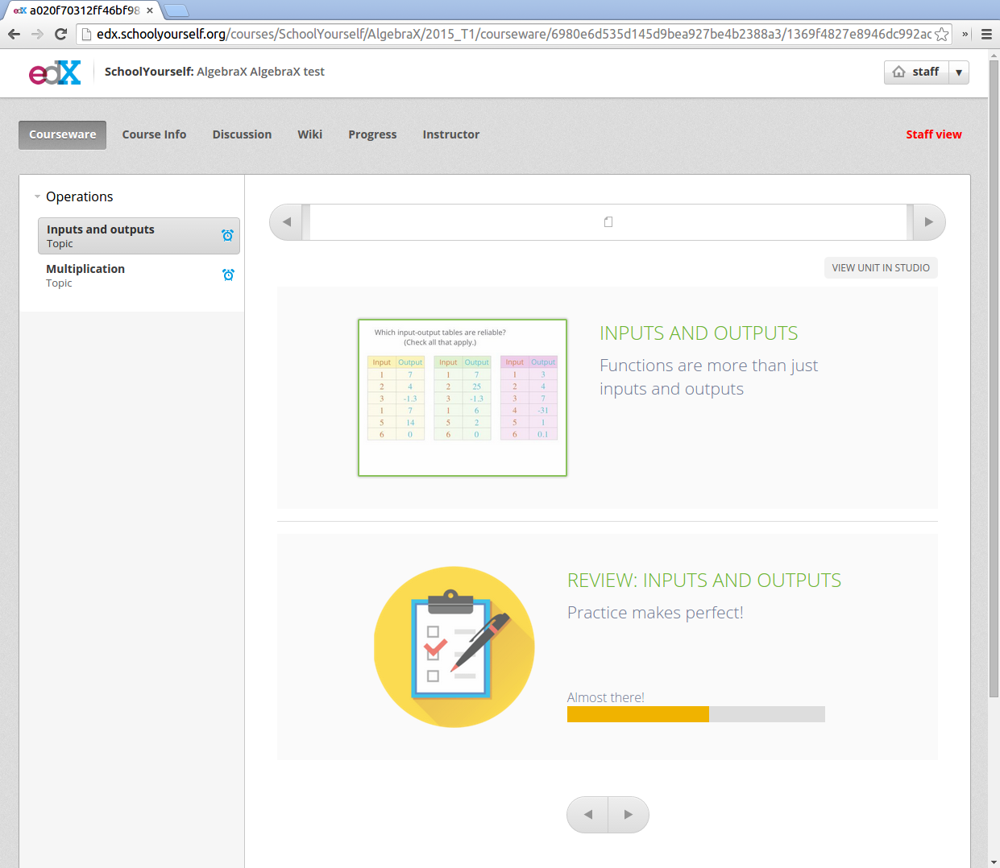
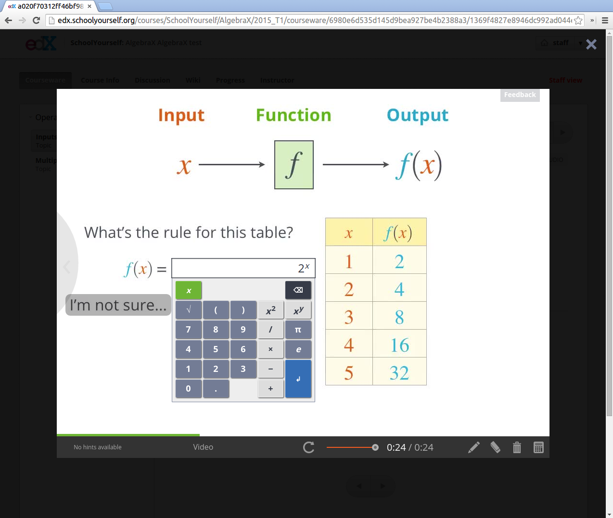

schoolyourself-xblock
============================

This repository contains XBlocks for displaying School Yourself (SY)
content on the edX platform. These will be used in the upcoming AlgebraX
and GeometryX courses, developed for the High School Initiative.

There are two similar XBlocks in this repository: `schoolyourself_lesson` and
`schoolyourself_review`. They both display an icon and some text, which
the user clicks on to open a modal dialog, which shows the actual lesson
(or assessment) in an iframe. In both cases, the user's anonymous user ID
is passed as a URL parameter, along with a signature. The key used to generate
the signature is provided by the content author (in this case, SY).

The following screenshot shows an example of a `schoolyourself_lesson` XBlock
and a `schoolyourself_review` XBlock:

If a user clicks on the lesson or review, they will see the following modal:

The review XBlocks participate in the course grade. The SY server
sends back information (via postMessage()) about mastery of various
topics as they proceed through a review, and some of that information
is used to update the user's grade on edX. This data is also signed,
with the same shared key mentioned above.
